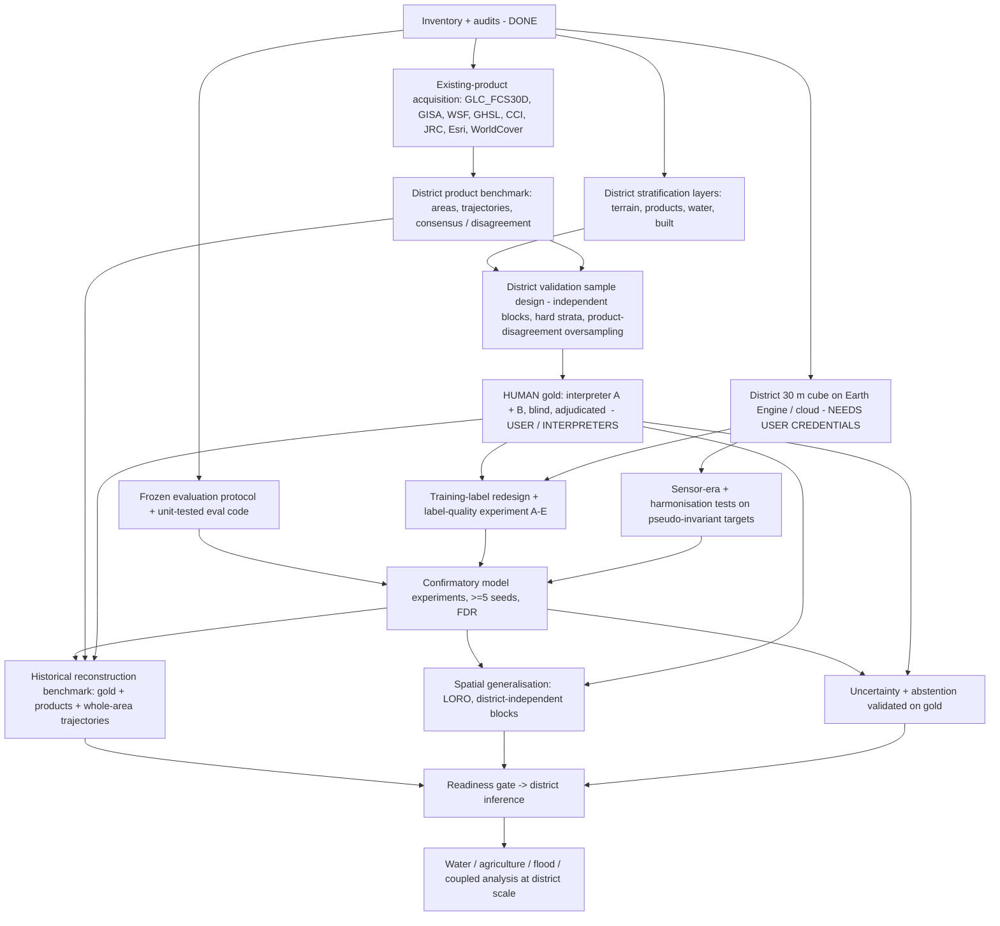

# Phase 4 — entry audit: what the foundation actually supports

_Written after the inventory (`docs/phase4_data_inventory.md`, `docs/phase4_data_quality.md`), the label audit (`docs/phase4_training_labels.md`) and the product-availability probe
(`docs/phase4_existing_products.md`). Every number below is in `data/inventory/`._

## 1. Phase 1–3 weakness matrix

| # | weakness | phase | evidence | consequence | Phase-4 remedy | blocks |
|---|---|---|---|---|---|---|
| W1 | no human (Tier A) labels | 2-3 | 0 / 558 points | no accuracy, no area estimate, Gates 1/6 of Phase 3 failed | district gold sample, 2 interpreters, adjudication | G2, G4, G5 |
| W2 | 30 m data cover 5.8 % of the district | 1 | 903 of 15 650 km² | no district claim possible | district cube on Earth Engine / cloud | G1, G6, G9 |
| W3 | gold sample drawn only in the 3 windows' TEST blocks | 2 | sampling frame | cannot validate district generalisation | new district stratified design | G2, G6 |
| W4 | silver labels = easy interior cells | 2-3 | edge share 7-25 % vs 65-72 % | inflated agreement (0.979), boundary/transition cells unlearned | human/VHR training labels incl. hard cells | G4 |
| W5 | rare-class support tiny in some windows | 2-3 | Baramati natveg 98, Mulshi built 393, corridor agri 2 069 cells | unstable held-out macro-F1 | stratified, class-balanced human labels | G4, G6 |
| W6 | labels valid only for 2020-21 | 2-3 | silver definition | historical failure (1990 corridor 74 % built vs WSF 21 %) | epoch-specific human labels; era-aware evaluation | G5 |
| W7 | no reference for agriculture / natural vegetation before 2020 | 1-3 | Tier B covers built + water only | non-built history unvalidatable | human gold at 1990/2000/2010 + GLC_FCS30D as benchmark | G5 |
| W8 | spatial autocorrelation > 3 km block for some classes | 2-3 | built-up corridor ~4 km | within-window test optimistic | leave-one-region-out + district-independent blocks | G6 |
| W9 | sparse early-era observations | 1 | 1990-2012 dry median 2-11 clear obs, post-monsoon 1-7 (typically 1-3), wet ~0 | annual reconstruction weakly constrained | epoch-level reconstruction + explicit temporal uncertainty | G5 |
| W10 | S2->OLI harmonisation corridor-specific | 3 | P3-I1 NOT SUPPORTED | fusion bias outside corridor | pseudo-invariant-target evaluation, alternatives | G1, G5 |
| W11 | cross-era Landsat harmonisation never validated on invariant targets | 1-2 | no PIF test exists | era shift confounded with land change | PIF test per era | G5 |
| W12 | evaluation/scoring errors | 3 | comparator bug (6 INVALID), E-group gap vs cross, inconsistent thresholds | false confidence in outcomes | frozen, unit-tested evaluation code before confirmatory runs | G8 |
| W13 | gate designed after related results | 3 | P3-E5 registered 19 s after C4 result | Gate 4 not blind | confirmatory tests frozen (hash) before execution | G8 |
| W14 | single seeds; no multiplicity control | 2-3 | most models one seed | lucky-run risk | >=5 seeds; FDR across families | G8 |
| W15 | never-settled frame lenient | 3 | F3: frame FBR 0.005 corridor vs window 50 % built in 1990 | model accepted on a flattering test | whole-area trajectories vs independent products | G5 |
| W16 | district rasters deleted, 240 m only | 1-2 | 520 metadata-only products | no district inference basis | rebuild at 30 m in the cloud | G1, G9 |
| W17 | no water gauge / storage / groundwater, no crop labels, one flood event | 1-3 | inventory | water/agri/flood claims limited to extent and proxies | obtain official data; otherwise scope down | domain papers |
| W18 | no admin (taluka), roads, census layers | 1-3 | inventory | no coupled-system or official-statistics comparison | OSM roads, census/taluka boundaries | coupled analysis |

## 2. Phase-4 execution dependency graph

Critical path: **human gold (E)** and **district cube (H)**. Neither can be completed inside this sandbox: E needs human interpreters with Google Earth Pro historical imagery; H needs Earth Engine (or a cloud VM) credentials. Everything in A-D, F-G and B can run now.

## 3. The seven-part assessment

### WHAT WE ACTUALLY HAVE
* A provenance-tracked scene archive: 2 685 Landsat (1989-2026), 3 526 Sentinel-2 (2015-2026), 884 Sentinel-1 scenes over the district.
* Analysis-ready 30 m data — 37-year Landsat seasonal/annual composites, S1 2017-2025, terrain — for three windows covering **5.8 %** of the district; S2 at 30 m only for 2021 and 2024; S2 at 10 m only for Baramati 2021.
* District-level composite **metadata** (observation statistics) for 1990-2026 at 240 m; most district rasters are no longer on disk.
* Independent reference products (WSF, GHSL, JRC) inside the windows; CHIRPS monthly rainfall district-wide; GHS-POP tiles.
* Silver labels (unanimous four-product consensus) for 39-80 % of window cells, valid for 2020-21; a 73 066-cell evaluation table; a 558-point blind gold design inside the windows; 437 provisional AI labels (2021, Tier C).
* A disciplined experiment registry with 63 Phase-3 records (failed and invalid ones kept) and a tested statistics/calibration library.

### WHAT WE THINK WE HAVE (but do not)
* "A district system" — we have 5.8 % of the district at 30 m.
* "An annual 1990-2026 record" — before 2013 the record rests on 2-11 clear dry-season observations and 1-7 (typically 1-3) post-monsoon ones; the wet season is unobserved; annual change at ±1 year is not observationally supported everywhere.
* "Validated land-cover maps" — every number is agreement with products or AI interpretation; nothing is validated by humans.
* "Training labels that represent the landscape" — silver labels sample interior cells (edge share 7-25 % vs 65-72 %) and leave transitions, mixtures and some whole classes nearly empty.
* "Independent spatial test blocks" — for several classes spatial correlation extends beyond the 3 km blocks.
* "A harmonised multi-sensor record" — the S2->OLI transform fails outside the corridor; cross-era Landsat consistency has never been tested on invariant surfaces.
* "Agriculture, water and flood products" — no crop labels, no gauge/storage/groundwater data, one flood event without an independent extent.

### WHAT WE ARE MISSING
1. Human Tier-A labels at several epochs, district-wide, double-interpreted.
2. A district-scale 30 m feature cube (cloud compute).
3. District-scale existing products (acquirable now) and Dynamic World / GAIA (need Earth Engine) and India decadal LULC (needs Earthdata).
4. Pseudo-invariant-target harmonisation evidence per sensor era.
5. Admin boundaries (talukas), roads, census population; reservoir levels/storage, gauges, groundwater; crop labels; independent flood extents.

### WHAT CAN BE TRUSTED
* Scene manifests, composite provenance and QA statistics; the post-fix composites in the windows. (19 of 58 label/reference rasters have a provenance sidecar; the rest rely on code + git history.)
* Tier-B products as independent references — with their own documented errors and definitions.
* Phase-3 *relative* findings inside the three windows (Tier B/C, associations): transfer gaps exist; SAR and terrain are associated with higher unseen-window agreement in the S1 era; multi-year labels and temporal context reduce false built-up on the never-settled frame; source-calibrated conformal sets fail to cover on new landscapes; the apparent drought effect is largely confounded with sensor era.

### WHAT CANNOT BE TRUSTED
* Any absolute accuracy or area number; any historical map (window-wide built share of the selected model is implausible before 2000); any district statement.
* Rankings between close models (single seeds, no multiplicity control, scoring errors found after the fact); Gate 4 of Phase 3 (not blind).
* Landsat-S2 fusion outside the corridor; pre-2000 annual maps; agriculture beyond observed seasonal proxies.

### WHAT MUST BE COLLECTED BEFORE TRAINING
1. **Human gold** for the new district validation design — first epochs 2020 and 2000 (VHR coverage best), then 2010 and 1990 where imagery exists; >= 20 % double interpretation; adjudication log.
2. **A separate human/VHR training-label set** (different blocks and points from validation), deliberately including boundary, mixed and transitional cells.
3. **District 30 m cube** (Landsat 1990-2026 seasonal composites, S1, S2, DEM) exported from Earth Engine with the repo's harmonisation, or run on a cloud VM.
4. **Earth Engine credentials** (Dynamic World, GAIA) and an **Earthdata login** (India decadal LULC).

### WHAT CAN ALREADY BE RUN
* Freeze the evaluation protocol and unit-test the evaluation code (no data needed).
* Acquire district-scale existing products (GLC_FCS30D, GISA, WSF, GHSL, ESA CCI, JRC, Esri, WorldCover) and run the product benchmark: areas, trajectories, consensus and disagreement maps.
* Build the district stratification and the district validation-sample design (oversampling hard strata and product disagreement) and the blind interpreter kit.
* Write the Earth Engine export pipeline for the district cube (ready to run with the user's project).
* Exploratory only: label-quality arms A and B, sensor-era distributions and harmonisation on pseudo-invariant targets inside the windows.

## 4. Phase-4 gates at entry

| gate | status at entry | reason |
|---|---|---|
| G1 data foundation | FAIL | 5.8 % of district at 30 m; sparse pre-2013 record |
| G2 human validation | FAIL | 0 Tier-A labels |
| G3 existing-product benchmark | NOT STARTED | acquirable now |
| G4 training-label quality | FAIL | easy-cell bias, no human training labels |
| G5 historical validity | FAIL | implausible whole-area trajectories; no historical gold |
| G6 spatial generalisation | FAIL | 3 regions only |
| G7 uncertainty | PARTIAL | characterised in 3 windows; not validated on gold |
| G8 confirmatory design | NOT STARTED | protocol to be frozen before any confirmatory run |
| G9 district scale | FAIL | no district cube |
